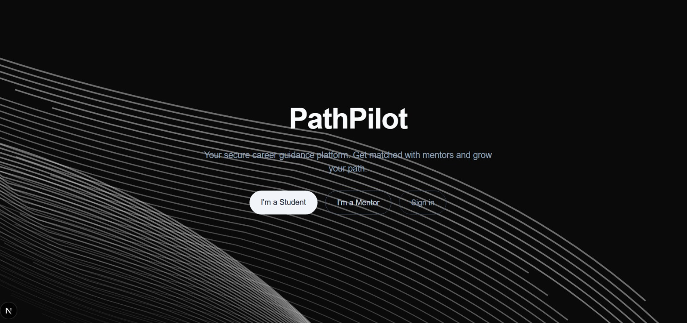

# PathPilot - Career Guidance Platform

A secure career guidance platform that connects students with mentors. Students create profiles and get matched with professionals; they can chat (ephemeral, not stored) and use voice/video calls within a session.



## Features

- **Student registration**: Sign up with name, age, field of study, interests, and goals. AI-driven follow-up questions for better matching.
- **Professional registration**: Sign up with bio, expertise, and experience.
- **Matching**: Rule-based matching by field of study and expertise; students can request a session with a mentor.
- **Sessions**: Request -> Accept -> Active -> End. Only session metadata is stored; chat is ephemeral and cleared when the session ends.
- **Chat**: Polling-based chat per session (no WebSocket required). Messages are kept in memory only and deleted when the session ends. Works with just `npm run dev`.
- **Voice/Video**: Optional WebRTC (peer-to-peer) with signaling over the WebSocket server when running `npm run ws`.
- **Reporting**: Students can report professionals; professionals can report students (reason + description).

## Tech Stack

- **Frontend**: Next.js 16 (App Router), React, Tailwind CSS
- **Backend**: Next.js API routes, WebSocket server (Node, `ws`)
- **Database**: PostgreSQL with Prisma
- **Auth**: NextAuth.js (credentials, JWT)
- **AI**: OpenAI API for personalized student questions (optional; falls back to static questions if no key)

## Setup

1. **Clone and install**
   ```bash
   cd PathPilot
   npm install
   ```

2. **Environment**
   - Copy `.env.example` to `.env`.
   - Set `DATABASE_URL` to your PostgreSQL connection string.
   - Set `NEXTAUTH_SECRET` to a long random secret, for example with `openssl rand -base64 32`.
   - Optional: set `OPENAI_API_KEY` for AI-generated onboarding questions.
   - Optional: set `WS_PORT` (default `3001`) and `NEXT_PUBLIC_WS_URL` (for example `ws://localhost:3001`) for the WebSocket server.
   - Do not commit your real `.env`. The repository keeps only `.env.example`.

3. **Database**
   ```bash
   npx prisma db push
   npx prisma generate
   ```

4. **Run**
   - **Chat only** (no voice/video):
     ```bash
     npm run dev
     ```
   - **Chat + voice/video**:
     ```bash
     npm run dev:all
     ```

5. Open [http://localhost:3000](http://localhost:3000). Sign up as a student or mentor, complete onboarding, click **Chat** to see your sessions, then **Open chat** to message. Use **End session** to close the session and clear chat history.

## Scripts

- `npm run dev` - Next.js dev server (chat works via polling)
- `npm run dev:all` - Next.js + WebSocket server (adds voice/video calls)
- `npm run build` - Production build
- `npm run start` - Production server
- `npm run ws` - WebSocket server (chat + WebRTC signaling)
- `npm run db:push` - Push Prisma schema to the database
- `npm run db:studio` - Open Prisma Studio

## Project Structure

- `app/` - Next.js App Router (auth, dashboard, chat, API routes)
- `app/api/` - REST APIs: auth, students, professionals, sessions, reports, `ws-token`
- `server/ws/` - Optional WebSocket server for WebRTC signaling
- `lib/` - Shared utilities: db, auth, ai, matching, chat-messages, ws-auth
- `prisma/` - Prisma schema

## Security And Privacy

- Auth uses JWT sessions with role-based access for students and professionals.
- Chat is not persisted; it stays in memory only and is cleared when a session ends.
- Protected APIs perform session and role checks.
- Reports are stored for moderation; permanent chat logs are not stored.
"# PathPilot-app" 
